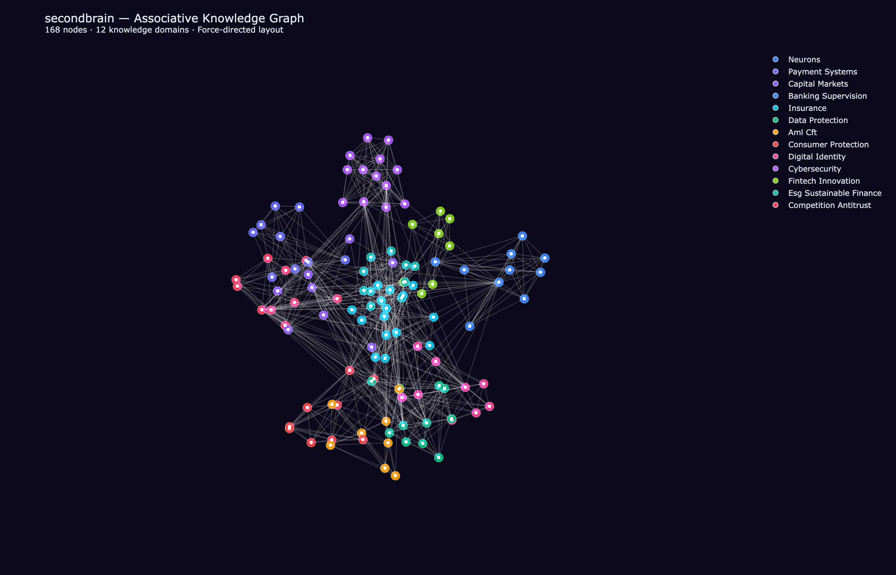
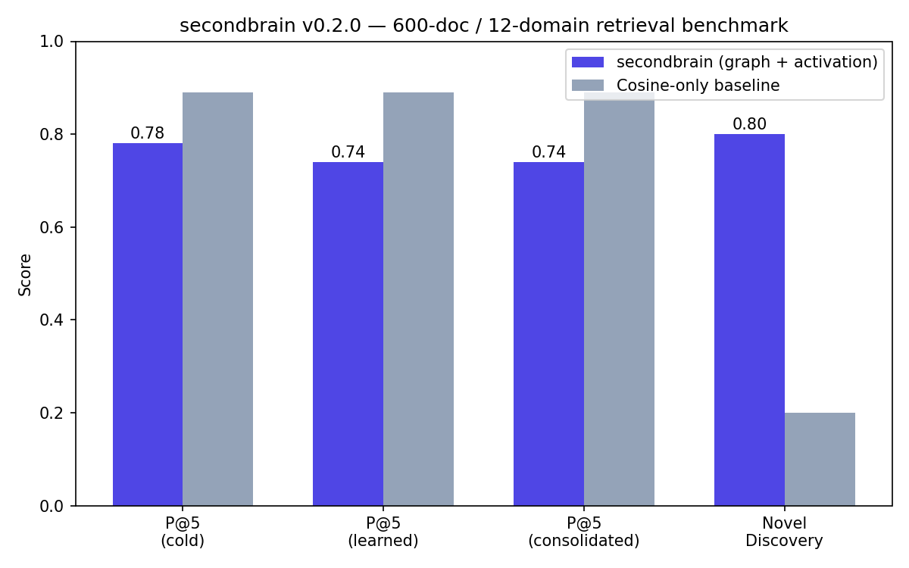

# secondbrain

Graph-based associative memory for LLM agents — not a flat vector store.

secondbrain implements **damped spreading activation retrieval** over a
self-wiring, self-learning weighted node/edge graph. It auto-extracts typed
entities via LLM, learns edge weights from co-retrieval patterns (Hebbian
reinforcement), and periodically consolidates dense clusters into compressed
summaries — the way episodic memory compresses into semantic knowledge during
sleep.

## Installation

```bash
# From GitHub (always latest)
pip install git+https://github.com/aadebusayo/second-brain.git

# From PyPI (when published)
pip install second-brain
```

## Quick start

```python
from secondbrain import SecondBrain

brain = SecondBrain()

# Store knowledge — entities auto-extracted via DeepSeek
brain.remember(
    "The Central Bank of Kenya requires all PSPs to comply with "
    "enhanced KYC under the Proceeds of Crime and Anti-Money Laundering Act."
)

# Retrieve with spreading activation — not just keyword match
results = brain.recall("payment service provider compliance requirements")
for node in results:
    print(node.text)

# Explain why a node surfaced
explanation = brain.explain(results[0].id)
print(explanation["seed_value"], explanation["hop_trace"])

# Entity management
cbk = brain.add_entity("Central Bank of Kenya", "Organization")
neighborhood = brain.get_entity_neighborhood(cbk.id)
```

## Architecture

```
remember(text)
  ├── embed (sentence-transformers, 384-dim)
  ├── auto-wire edges via cosine similarity
  ├── auto-extract entities via LLM (DeepSeek)
  └── persist node + edges to SQLite

recall(query)
  ├── embed query
  ├── seed: cosine top-k
  ├── propagate: damped spreading activation, 3 hops
  │     a_i = a_i(0) + B(i) + γ·Σ(w_ij·a_j)
  └── assemble: knapsack under token budget

consolidate()
  ├── find dense co-activated subgraphs
  ├── LLM-summarise each cluster
  ├── rewire edges to summary node
  └── demote originals (preserve provenance)

explain(node_id)
  └── seed value + hop trace + base_level + neighbour contributions
```

## Visualization

**Interactive 3D graph** — open [`docs/graph_3d.html`](docs/graph_3d.html) in your browser to explore
the associative knowledge graph (168 nodes, 12 domains, force-directed layout, rotatable/zoomable).



## Benchmarks

600-document corpus across 12 domains (fintech, banking, insurance, data protection, AML, etc.):



| Metric | Score |
|---|---|
| Novel Discovery Rate | **80%** — graph surfaces relevant docs cosine misses |
| P@5 (cold start) | **0.78** |
| P@5 (after Hebbian learning) | **0.74** — stable, no degradation |
| P@5 (after consolidation) | **0.74** — sleep cycle preserves quality |
| Cosine-only baseline | 0.89 — scans all 600 docs directly |

Run the benchmark yourself: `python tests/longitudinal_benchmark.py`

## Configuration

Create a `.env` file (see `.env.example`):

```bash
# Embedding provider (default: sentence-transformers)
EMBEDDING_PROVIDER=sentence-transformers

# LLM for entity extraction & consolidation
SECOND_BRAIN_LLM_PROVIDER=deepseek
DEEPSEEK_API_KEY=sk-your-key

# Algorithmic tuning
SECOND_BRAIN_GAMMA=0.6
SECOND_BRAIN_HOPS=3
SECOND_BRAIN_WIRE_THRESHOLD=0.4

# Auto-consolidation after N new nodes
SECOND_BRAIN_CONSOLIDATE_EVERY_N=100
```

## API

| Function | Description |
|---|---|
| `remember(text, entities=None)` | Store a memory node, auto-extract entities |
| `recall(query, token_budget=2000)` | Retrieve via spreading activation |
| `explain(node_id)` | Full activation math for a node |
| `consolidate()` | Run the sleep cycle |
| `mark_relevant(node_id)` | Confirm retrieval relevance |
| `reinforce_pair(a, b)` | Strengthen edge between co-relevant nodes |
| `add_entity(name, type)` | Create a typed entity node |
| `add_relation(src, tgt, type)` | Add a typed relation between entities |
| `get_entity_neighborhood(id)` | Linked entities + chunks + stats |

## MCP Server

secondbrain exposes its API as MCP tools for any MCP-compatible agent harness:

```bash
python -m secondbrain.mcp_server
```

## Design

- **Pluggable embeddings**: sentence-transformers (default), OpenAI, Anthropic, local
- **Pluggable vector stores**: LanceDB, in-memory
- **Durable**: SQLite persistence for nodes and edges
- **Explainable**: Every retrieval decision traceable
- **Self-evolving**: Entities extracted and refined by LLM, not a fixed schema
